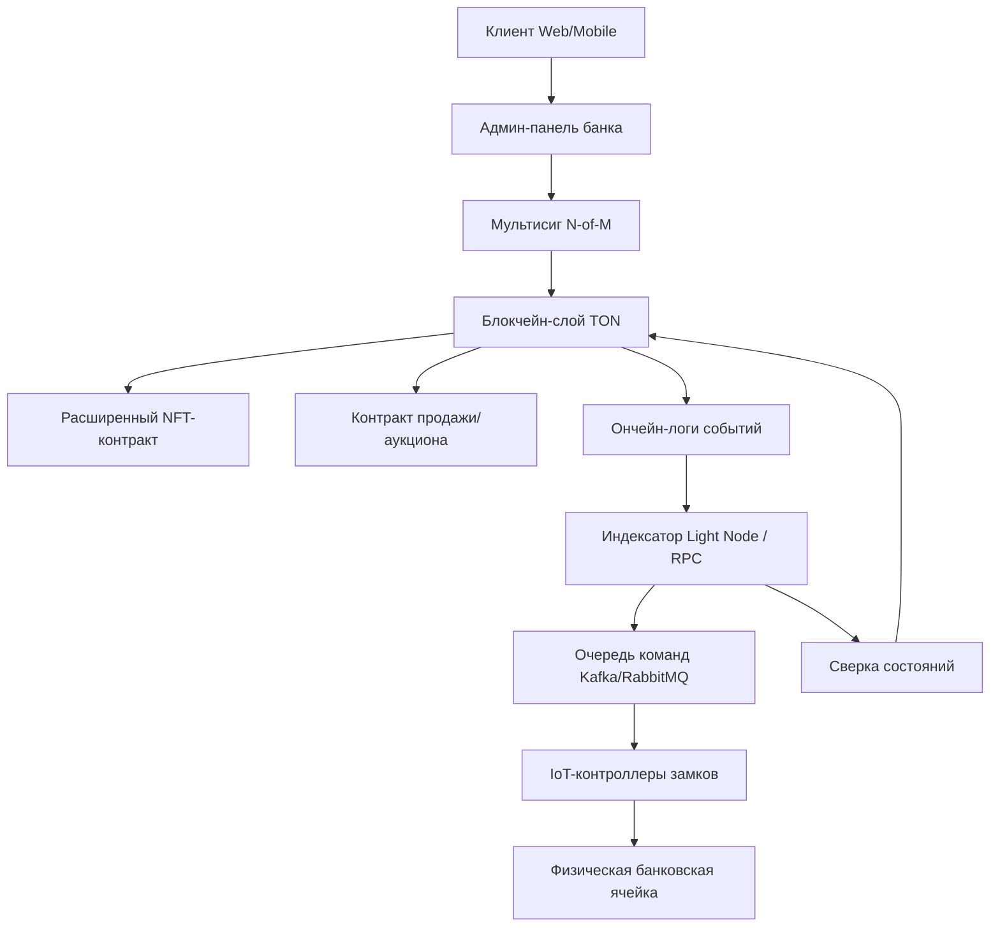
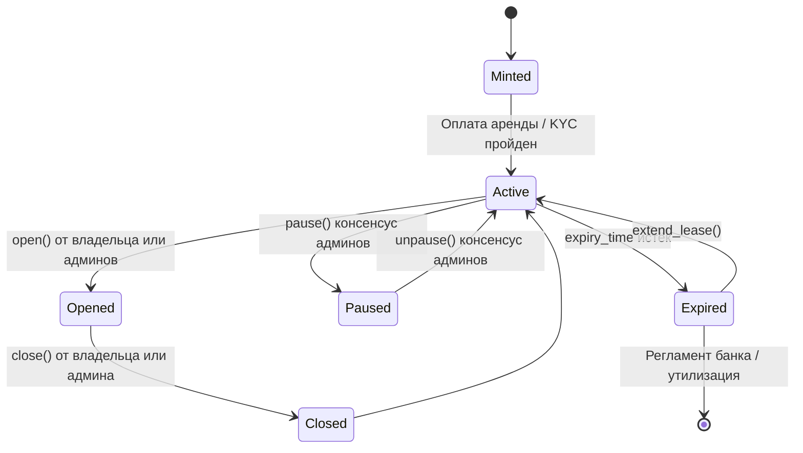
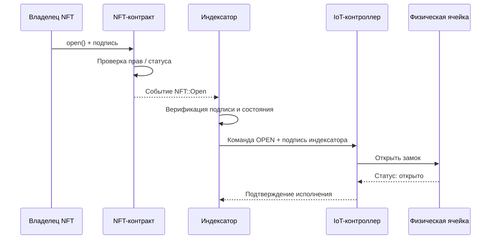
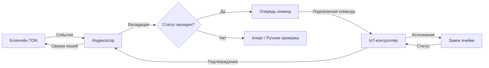
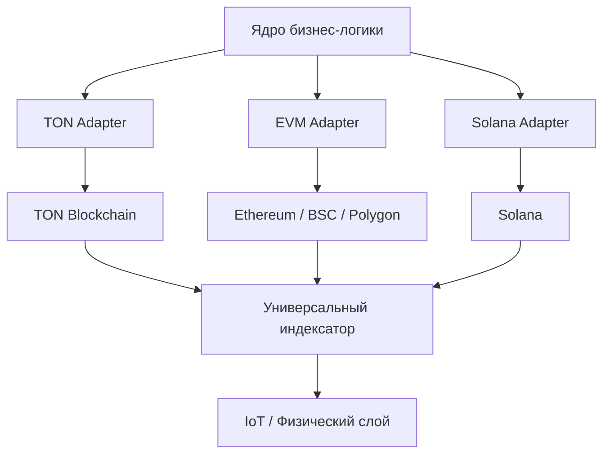
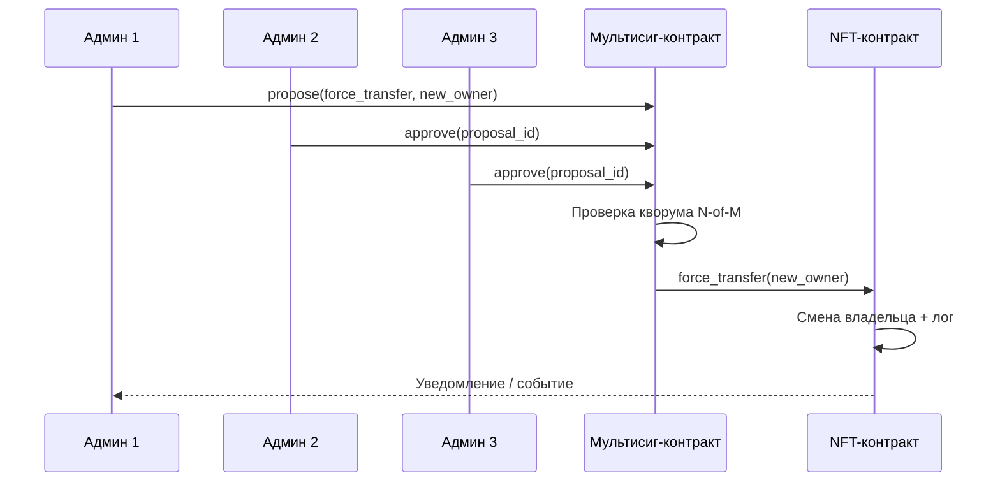

# Whitepaper: Децентрализованная система управления банковскими ячейками на базе NFT и блокчейна

**MVP на TON | Архитектура с поддержкой мультичейна | Интеграция с физическим доступом**

---

## 📄 Аннотация

Данный документ описывает архитектуру и логику работы системы управления банковскими сейфовыми ячейками, где право доступа и договор аренды токенизируются в виде NFT. Каждый NFT представляет собой цифровой ключ, контракт аренды и неизменяемый журнал операций. В метаданные токена может быть зафиксирован криптографический «отпечаток» описания содержимого и фотофиксации (хеш или Merkle-корень), что позволяет независимой третьей стороне сверить предъявленные материалы с тем, что было заявлено при приёмке ячейки, не раскрывая само содержимое в блокчейне. Система использует расширенный стандарт NFT на блокчейне TON, мультиподпись администраторов банка, автоматизированное продление аренды и модульные контракты продажи/передачи. Физический доступ к ячейкам синхронизируется с ончейн-состоянием через защищённый индексатор и IoT-контроллеры. Архитектура спроектирована с учётом регуляторных требований, безопасности и последующего расширения на другие блокчейны.

---

## 1. Проблема и мотивация

Традиционные банковские ячейки сталкиваются с рядом ограничений:

- Бумажные договоры и ручное управление сроками аренды.
- Отсутствие прозрачного аудита доступа и операций.
- Сложность передачи прав, наследования или временного делегирования доступа.
- Зависимость от рабочего времени персонала и человеческий фактор.
- Риски утери ключей, несанкционированного доступа и спорных ситуаций.

Блокчейн и NFT позволяют оцифровать право доступа, автоматизировать платежи и сроки, обеспечить криптографически верифицируемый аудит и создать гибкие сценарии передачи прав без потери контроля со стороны банка.

---

## 2. Концепция решения

- **NFT = цифровой ключ + договор аренды + история операций** (опционально — привязка к **хешу инвентарной описи и фотографий содержимого** для последующей верификации третьей стороной: нотариус, оценщик, арбитр, контрагент при сделке).
- Банк выпускает управляемую коллекцию NFT. Каждый токен привязан к конкретной физической ячейке.
- Смарт-контракт NFT расширен кастомной логикой: пауза, открытие/закрытие, продление аренды, принудительная смена владельца.
- Все действия записываются ончейн. Физические замки реагируют на верифицированные события из блокчейна.
- Модульные контракты продажи/передачи обеспечивают фиксированные цены, аукционы, временные окна, отзыв листинга и адресацию конкретного покупателя.
- MVP разворачивается на TON. Архитектура абстрагирована для последующей поддержки EVM, Solana, Near и других сетей.

---

## 3. Архитектура системы

**Компоненты:**

- **Клиентский слой:** Web/Mobile интерфейс для владельцев NFT и покупателей.
- **Админ-панель:** Управление коллекцией, мониторинг, инициирование мультисиг-операций.
- **Блокчейн-слой:** NFT-контракты, escrow-продажи, мультисиг, неизменяемые логи.
- **Индексатор:** Подписка на события, валидация, подпись команд, маршрутизация в IoT.
- **Физический слой:** Электромеханические замки, контроллеры, резервное питание, изолированная сеть.

---

## 4. Смарт-контракты

### 4.1. Расширенный NFT-контракт (MVP на TON)

Совместим с TEP-62/TEP-64. Кастомная логика реализуется через дополнительные opcode и внутреннюю машину состояний.

| Функция                     | Инициатор                              | Условие исполнения           | Эффект                                                               |
| --------------------------- | -------------------------------------- | ---------------------------- | -------------------------------------------------------------------- |
| `pause()` / `unpause()`     | Мультисиг админов (N-of-M)             | Кворум подписей ончейн       | Блокировка/разблокировка всех операций с NFT                         |
| `open()`                    | Владелец NFT **ИЛИ** мультисиг админов | Подпись владельца или кворум | Статус `open`, событие для индексатора                               |
| `close()`                   | Владелец **ИЛИ** любой админ (1-of-M)  | Подпись инициатора           | Статус `closed`, событие для индексатора                             |
| `extend_lease()`            | Любой адрес (обычно владелец)          | Входящий TON ≥ тарифа        | Автофорвард на адрес банка, `expiry_time += Δ` (не выше `MAX_LEASE`) |
| `force_transfer(new_owner)` | Мультисиг админов                      | Кворум + валидный адрес      | Смена владельца, логирование, уведомление                            |

#### 🔄 Машина состояний NFT

**Метаданные:** ID ячейки, `expiry_time`, `max_lease`, тариф, хеш договора аренды (оффчейн), **хеш фиксации содержимого** (см. ниже), история событий (ончейн логи).  
**Особенности TON:** асинхронная передача сообщений, `forward_ton_amount`, `bounce`, обработка входящих платежей через `op::extend_lease`.

#### Фиксация содержимого ячейки для третьих сторон (content attestation)

По желанию клиента и в рамках регламента банка при приёмке или инвентаризации в NFT **вшивается только криптографическая привязка** к описанию и визуальной фиксации содержимого, а не сами файлы и не персональные данные в открытом виде:

- **Оффчейн:** структурированное текстовое описание (опись), набор фотографий в согласованном формате (например, снятие под углами, штампы даты в EXIF или отдельный сертификат съёмки). Источники хранятся у банка и/или у клиента по политике хранения (зашифрованное хранилище, выдача по запросу при споре).
- **Ончейн:** один или несколько **обязательств (commitments)** — например, **SHA-256 / Blake2** от канонической сериализации описания и изображений, либо **Merkle-корень** по листьям «файл → хеш», чтобы можно было раскрыть только часть материалов при необходимости. В метаданных NFT хранится этот корень/хеш, версия алгоритма и при необходимости ссылка на оффчейн-пакет (URI без обязательной публикации персональных данных).
- **Верификация третьей стороной:** доверенное лицо получает копию описания и фото (или доступ под присягой / по NDA), **пересчитывает хеш тем же регламентом** и сравнивает с записью в NFT в блокчейне. Совпадение доказывает, что предъявленный комплект соответствует зафиксированному на момент опечатывания **инварианту содержимого**, без необходимости доверять только словам одной из сторон.

Обновление описи после повторного открытия ячейки оформляется как **новое событие** (новый хеш или новая версия метаданных по регламенту), чтобы сохранялась аудиторская история изменений.

### 4.2. Контракты продажи / передачи прав

Модульные escrow-контракты, не встроенные в NFT, а взаимодействующие с ним через стандартный `transfer`.

| Параметр                      | Описание                                                                                                                       |
| ----------------------------- | ------------------------------------------------------------------------------------------------------------------------------ |
| `sale_type`                   | `fixed` или `auction` (английский/голландский)                                                                                 |
| `start_time` / `end_time`     | Временное окно листинга                                                                                                        |
| `revocable`                   | `true` → владелец может отозвать до продажи                                                                                    |
| `whitelist_buyer`             | Опциональный адрес единственного покупателя                                                                                    |
| `min_price` / `reserve_price` | Пороги для аукциона                                                                                                            |
| `escrow_flow`                 | Покупатель вносит средства → контракт проверяет условия → вызывает `nft::transfer` → средства уходят продавцу/банку (комиссия) |

### 4.3. Мультисиг администраторов

- Схема `N-of-M` (например, 3-of-5).
- Ончейн proposals, хранение публичных ключей, ротация через кворум.
- Роли: `admin` (close, open, pause), `super_admin` (force_transfer, config), `auditor` (read-only, экспорт логов).
- Все действия логируются с `msg_hash`, `timestamp`, `initiator`.

---

## 5. Индексация и физическая интеграция

### 5.1. Поток открытия ячейки (Sequence)

### 5.2. Синхронизация индексатора и IoT

**Особенности:**

- Индексатор работает на базе TON Light Client / RPC-ноды.
- Подписывает команды ключом HSM, использует `nonce` и TTL для защиты от replay.
- IoT-контроллеры в изолированной VLAN, без прямого выхода в интернет.
- Fallback: ручной протокол открытия по бумажному регламенту банка + ончейн-лог постфактум.
- Периодический `state_reconciliation` (хеши состояний, сверка журналов).

---

## 6. Безопасность и комплаенс

| Уровень           | Меры                                                                                                                                                           |
| ----------------- | -------------------------------------------------------------------------------------------------------------------------------------------------------------- |
| **Ончейн**        | Аудит контрактов, формальная верификация критических путей, pause-механизм, лимиты `MAX_LEASE`, мультисиг, replay-защита, bounce-обработка                     |
| **Оффчейн / IoT** | Изолированная сеть, mTLS, HSM для ключей банка и индексатора, резервное питание, журнал доступа с WORM-хранением                                               |
| **Данные**        | Персональные данные и содержимое ячеек хранятся оффчейн. Ончейн — ID, хеши договоров, **хеш описания и фотофиксации содержимого (commitment)** для независимой проверки третьей стороной, статусы, временные метки |
| **Регуляторика**  | Соответствие 115-ФЗ (AML/KYC), 152-ФЗ / GDPR, банковские регламенты хранения. NFT юридически оформляется как цифровой дубликат договора аренды и ключа доступа |
| **Страхование**   | Разграничение ответственности: блокчейн-слой, индексатор, физический доступ. Полисы на киберриски и операционные сбои                                          |

---

## 7. Мультичейн-стратегия

| Этап              | Реализация                                                                                         |
| ----------------- | -------------------------------------------------------------------------------------------------- |
| **MVP**           | TON (TEP-62/64, низкие комиссии, высокая пропускная способность, удобная работа с NFT и мультисиг) |
| **Абстракция**    | Chain-adapter слой: интерфейсы `INFT`, `ISale`, `IMultisig`, `IIndexer`                            |
| **EVM**           | ERC-721 + кастомные расширения, OpenZeppelin Multisig, The Graph / Subgraph для индексации         |
| **Solana / Near** | SPL NFT / NEP-171, программные аккаунты, RPC-индексаторы                                           |

Архитектура не зависит от конкретного блокчейна на уровне бизнес-логики. Адаптеры реализуют специфичные стандарты и механизмы подписей.

---

## 8. Пользовательские сценарии (User Flow)

### 8.1. Консенсус администраторов (Force Transfer / Pause)

### 8.2. Основные сценарии

1. **Оформление аренды**
  Клиент проходит KYC → банк минтит NFT → клиент оплачивает аренду (TON) → `expiry_time` установлен → статус `active` → доступ разрешён.
2. **Продление аренды**
  Перевод TON на адрес NFT → контракт проверяет сумму → форвардит платеж банку → `expiry_time += Δ` (≤ `MAX_LEASE`) → событие `LeaseExtended`.
3. **Открытие / закрытие**
  Владелец подписывает транзакцию `open()`/`close()` → индексатор верифицирует → IoT исполняет → лог ончейн + оффчейн.
4. **Продажа / передача**
  Листинг через escrow-контракт → покупатель вносит средства → проверка условий → `nft::transfer` → новый владелец получает доступ.
5. **Экстренный доступ / смена владельца**
  Мультисиг админов формирует proposal → кворум → `open()` или `force_transfer()` → ончейн-лог → уведомление клиента → аудит.
6. **Истечение срока**
  `expiry_time` пройден → статус `expired` → доступ заблокирован → grace period → регламент банка (возврат содержимого, аукцион прав, утилизация).
7. **Подтверждение состава содержимого для третьей стороны**
  При приёмке формируются описание и фото → считается ончейн-commitment (хеш / Merkle-корень) → записывается в метаданные NFT. Нотариус, оценщик или контрагент получает материалы, пересчитывает хеш и сверяет с блокчейном → получает криптографическое подтверждение соответствия без публикации содержимого в сети.

---

